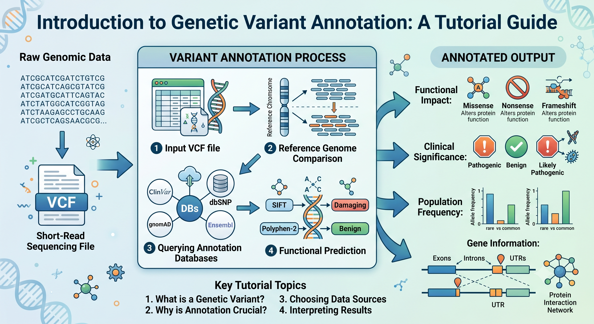
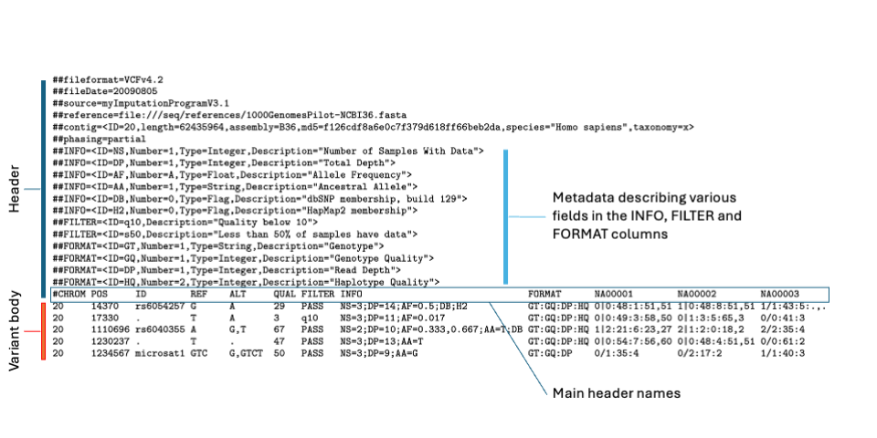

:::::::::::::::::::::::::::::::::::::: questions 

- What is variant annotation?
- How do you annotate variants?

::::::::::::::::::::::::::::::::::::::::::::::::

::::::::::::::::::::::::::::::::::::: objectives

- Assign biological feature and meaning to genetic variations
- Explain how to annotate variants
- What tools and methods are used to annotate variants
- Explain how variant annotations can be used to prioritise variants

::::::::::::::::::::::::::::::::::::::::::::::::

```{r, echo=FALSE}
options(digits = 3)
```

## Introduction

This is an introduction to variant annotation. We will cover the basics of what 
variant annotation is, how it works, and why it is important in genomics research 
and clinical applications. By the end of this episode, you should have a good 
understanding of the fundamental concepts of variant annotation and be able to 
apply this knowledge to your own genomic analyses.

The workshop is designed to be interactive, so we will have exercises and challenges 
throughout the episode to help you practice what you have learned. Don't worry if 
you get stuck, we will provide solutions and explanations to help you along the way.

This workshop is designed for users with fundamentals of genomics and bioinformatics, 
and have some background in working in the shell environment.

<!-- What you need to know is that there are three sections required for a valid
Carpentries lesson template:

 1. `questions` are displayed at the beginning of the episode to prime the
    learner for the content.
 2. `objectives` are the learning objectives for an episode displayed with
    the questions.
 3. `keypoints` are displayed at the end of the episode to reinforce the
    objectives.
 -->

::::::::::::::::::::::::::::::::::::: callout
<!-- Callout sections can highlight information. -->

Our starting point for RNA-seq analysis will be a list of variants in a VCF file. See previous 
variant calling workshops for how to go from raw sequencing data to a VCF file. We won’t cover 
this in the workshop, but we will cover how to annotate variants in a VCF file.

::::::::::::::::::::::::::::::::::::::::::::::::

## Background

<!-- Variant annotation is the process of assigning biological meaning to genetic variants. This 
can include identifying the gene that a variant is located in, predicting the effect of a variant 
on the protein product, and annotating the frequency of a variant in different populations. Variant 
annotation is an essential step in genomic analyses, as it helps researchers and clinicians 
understand the potential impact of genetic variants on health and disease. -->
Variant annotation is the process of adding biological context to genetic variants so that 
researchers and clinicians can better understand what they might mean. This involves identifying 
which gene a variant is associated with, predicting how it could affect the resulting protein, 
and examining how common it is across different populations. By providing this information, 
variant annotation plays a crucial role in genomic analysis, helping to assess the potential 
significance of genetic changes in health, disease, and individual patient care.

{width=90%}

Figure 1: Overview of variant annotation. The process of variant annotation involves taking raw 
genomic coordinates (such as those found in a VCF file) and intersecting them with curated biological 
databases to assign genetic consequence, functional annotation, and population-level metadata to 
each identified sequence variation. This helps provide biological context to the variants and can 
guide clinical management.

The VCF file format ([VCF v4.2 specification](https://samtools.github.io/hts-specs/VCFv4.2.pdf)) is a standard 
format for storing genetic variant data. It contains information about the position of the variant 
in the genome, the reference and alternate alleles, and various annotations about the variant. The 
VCF file format is widely used by various variant calling programs to output variant data, and it is 
important to understand how to work with VCF files when performing variant annotation. In this workshop, 
we will be working with an example VCF file and using various tools and resources to annotate the 
variants contained within them. In this workshop, we will cover how to use [Ensembl 
VEP](https://asia.ensembl.org/info/docs/tools/vep/index.html) to annotate variants, as well as how to 
interpret the results of variant annotation and use them to prioritize variants for further analysis. 
By the end of this workshop, you should have a good understanding of how to perform variant annotation 
and how to use the results to inform your genomic analyses.

{width=90%}

Figure 2: An example VCF file can be found here


The important variant information colums in a VCF file include: 
CHROM, POS, ID, REF, ALT, QUAL, FILTER, INFO. 
The CHROM and POS columns provide the genomic coordinates of the variant, while the REF and ALT columns indicate 
the reference and alternate alleles. The INFO column contains additional annotations about the variant, such as its 
predicted effect on the protein product or its frequency in different populations. Understanding these columns is 
crucial for performing variant annotation and interpreting the results. 
Make a table describing the columns in a VCF file and their significance in variant annotation 

CHROM|POS|ID|REF|ALT|QUAL|FILTER|INFO
---|---|---|---|---|---|---|---
Chromosome|Position|Variant ID|Reference Allele|Alternate Allele|Quality Score|Filter Status|Additional Annotations


<!-- Inline instructor notes can help inform instructors of timing challenges
associated with the lessons. They appear in the "Instructor View"

::::::::::::::::::::::::::::::::::::::::::::::::::::::::::::::::::::::::::::::::

::::::::::::::::::::::::::::::::::::: challenge 

## Challenge 1: Can you do it?

What is the output of this command?

```r
paste("This", "new", "lesson", "looks", "good")
```

:::::::::::::::::::::::: solution 

## Output
 
```output
[1] "This new lesson looks good"
```

:::::::::::::::::::::::::::::::::


## Challenge 2: how do you nest solutions within challenge blocks?

:::::::::::::::::::::::: solution 

You can add a line with at least three colons and a `solution` tag.

:::::::::::::::::::::::::::::::::
::::::::::::::::::::::::::::::::::::::::::::::::

## Figures

You can also include figures generated from R Markdown:

```{r pyramid, fig.alt = "pie chart illusion of a pyramid", fig.cap = "Sun arise each and every morning"}
pie(
  c(Sky = 78, "Sunny side of pyramid" = 17, "Shady side of pyramid" = 5),
  init.angle = 315,
  col = c("deepskyblue", "yellow", "yellow3"),
  border = FALSE
)
```

Or you can use standard markdown for static figures with the following syntax:

`{alt='alt text for
accessibility purposes'}`

{alt='Blue Carpentries hex person logo with no text.'}

::::::::::::::::::::::::::::::::::::: callout

Callout sections can highlight information.

They are sometimes used to emphasise particularly important points
but are also used in some lessons to present "asides": 
content that is not central to the narrative of the lesson,
e.g. by providing the answer to a commonly-asked question.

::::::::::::::::::::::::::::::::::::::::::::::::


## Math

One of our episodes contains $\LaTeX$ equations when describing how to create
dynamic reports with {knitr}, so we now use mathjax to describe this:

`$\alpha = \dfrac{1}{(1 - \beta)^2}$` becomes: $\alpha = \dfrac{1}{(1 - \beta)^2}$

Cool, right?

::::::::::::::::::::::::::::::::::::: keypoints 

- Use `.md` files for episodes when you want static content
- Use `.Rmd` files for episodes when you need to generate output
- Run `sandpaper::check_lesson()` to identify any issues with your lesson
- Run `sandpaper::build_lesson()` to preview your lesson locally

:::::::::::::::::::::::::::::::::::::::::::::::: -->

[r-markdown]: https://rmarkdown.rstudio.com/
